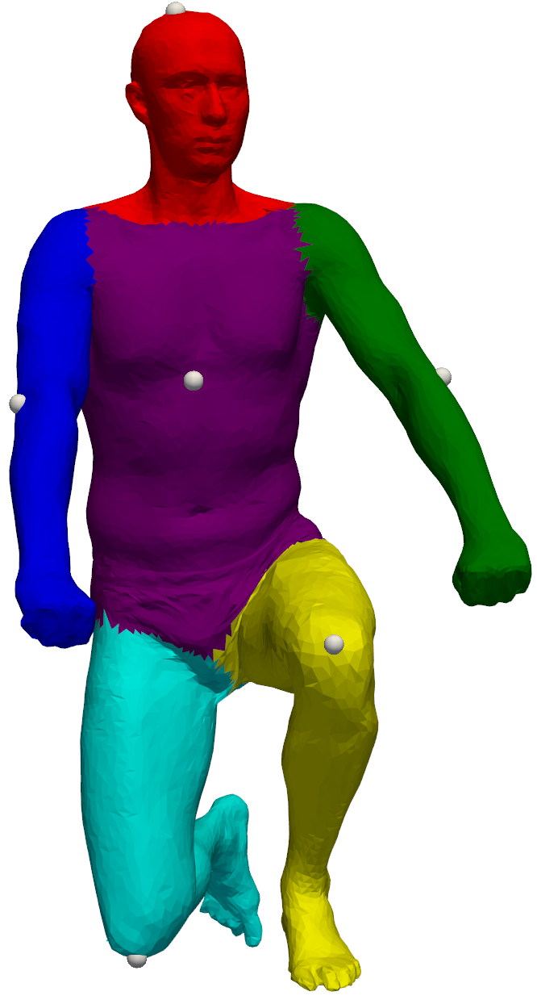
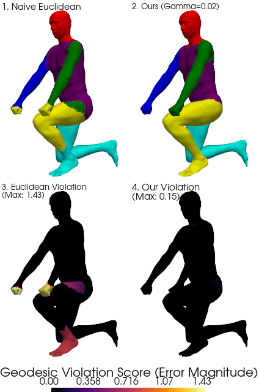
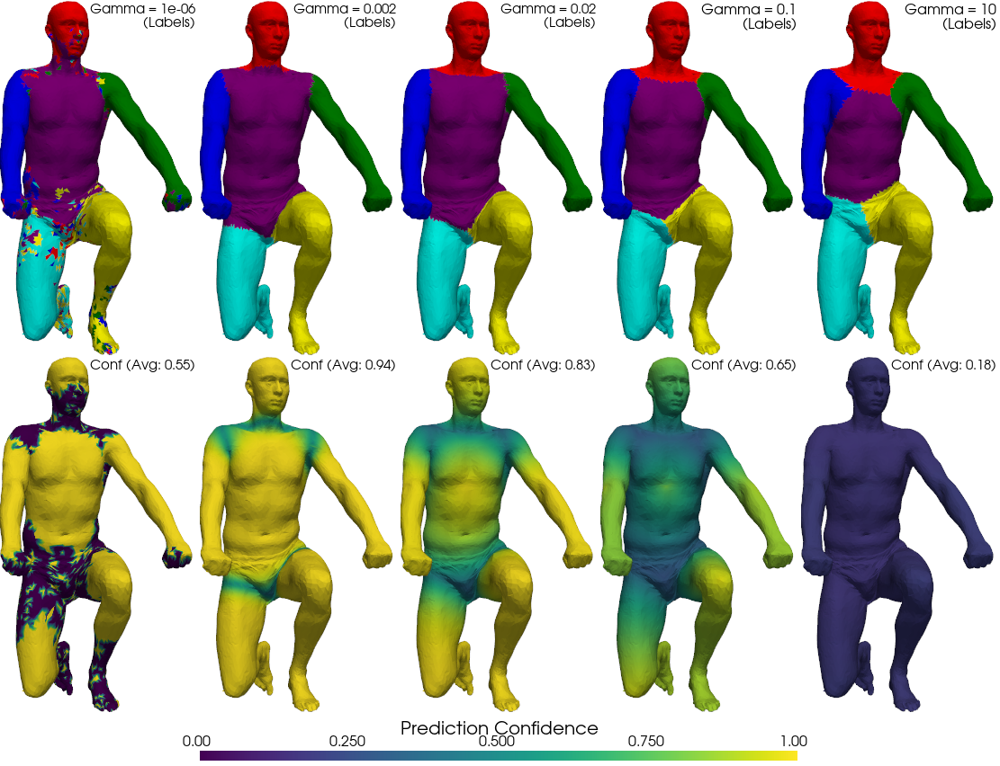

# Robust Manifold Segmentation via Entropic Wasserstein Propagation

  

> **Author:** Roee Ben-Shlomo
> **Institution:** Tel Aviv University

## Overview

This repository explores the application of optimal transport and heat diffusion for robust 3D mesh segmentation. It implements a Wasserstein propagation algorithm based on Solomon et al.'s *Convolutional Wasserstein Distances*. 

By leveraging **entropic regularization** and approximating geodesic distances via **heat diffusion**, this approach overcomes the traditional $O(N^3)$ computational bottleneck of Optimal Transport, reducing it to a highly efficient $O(N)$ sparse linear algebra problem.

---

## Theoretical Background

### 1. The Optimal Transport Problem

The 2-Wasserstein distance provides a meaningful metric for comparing two probability distributions ($\mu$ and $
u$) on a manifold $\mathcal{M}$. Unlike point-wise metrics, it accounts for the underlying geometry of the domain, measuring the minimum "work" required to transport mass.

### 2. Entropic Regularization

To make the problem computationally tractable on detailed 3D meshes (thousands of vertices), an entropy penalty $H(\pi)$ is added to the transport cost. This parameter ($\gamma$) controls the trade-off between geometric precision and diffusion, allowing the optimal transport plan to be found iteratively using the **Sinkhorn Algorithm**.

### 3. The Convolutional Insight

Using Varadhan's formula, the geodesic distance can be linked to the heat kernel $\mathcal{H}_t$. By setting the diffusion time to $t = \gamma/2$, we approximate the distance kernel with the heat kernel. Instead of computing explicit all-pairs distances, we perform convolutions by solving the heat diffusion equation using the **cotangent Laplacian**.

---

## Experiments & Results

The algorithm was implemented in Python utilizing `scipy.sparse` for solvers and `PyVista` for rendering, tested on human poses from the SCAPE dataset.

### Experiment 1: Topological Consistency

We compared our Geodesic (Wasserstein) approach against a naive Euclidean approach (Nearest Neighbors in 3D space) using 7 sparse anchor vertices.

  

* **Naive Euclidean:** Fails at complex topological interfaces (e.g., when the hand rests close to the knee). It incorrectly segments the knee as part of the hand due to short spatial distance, resulting in a high Geodesic Violation Score (Max: 1.43).
* **Ours (Wasserstein):** Successfully diffuses probability along the actual surface geometry of the manifold (up the arm, across the shoulder, down the torso), keeping the violation score negligible (Max: 0.13).

### Experiment 2: Stability vs. Regularization ($\gamma$)

We analyzed the behavioral regimes of the entropic regularization parameter ($\gamma$):

  

* **Numerical Instability ($\gamma     o 0$):** Heat kernel values approach zero, causing underflow in Sinkhorn iterations.
* **The Sweet Spot ($\gamma \in [0.002, 0.1]$):** Segmentation is stable. Lower values yield sharper boundaries, while higher values provide a soft segmentation confidence map.
* **Over-Regularization ($\gamma = 10.0$):** Mass spreads excessively, drowning out meaningful transport plans. Average confidence drops significantly.

---

## Future Research: Spectral Seeding

Currently, the pipeline relies on manual initialization of the seed anchors. Future directions propose automating this using **Spectral Geometry**:

1. **Spectral Clustering Initialization:** Extracting the low-frequency eigenvectors of the Laplace-Beltrami operator to perform KMeans clustering in the spectral embedding domain.
2. **Deep Spectral Seeding (DiffusionNet):** Utilizing Heat Kernel Signatures (HKS) as deformation-invariant features to train a supervised model (like DiffusionNet) to predict semantic seed maxima.

---

## References

1. Sharp, N., et al. (2022). *DiffusionNet: Discretization agnostic learning on surfaces*.
2. Solomon, J., et al. (2015). *Convolutional wasserstein distances*. ACM Transactions on Graphics (TOG).
